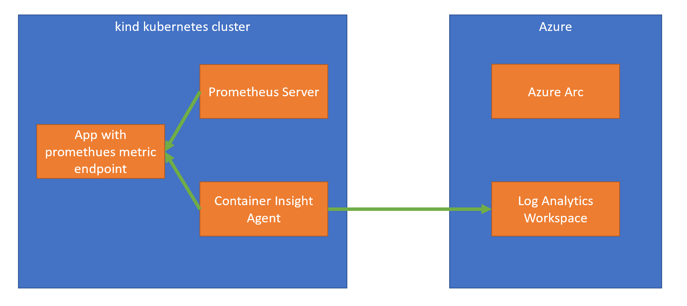
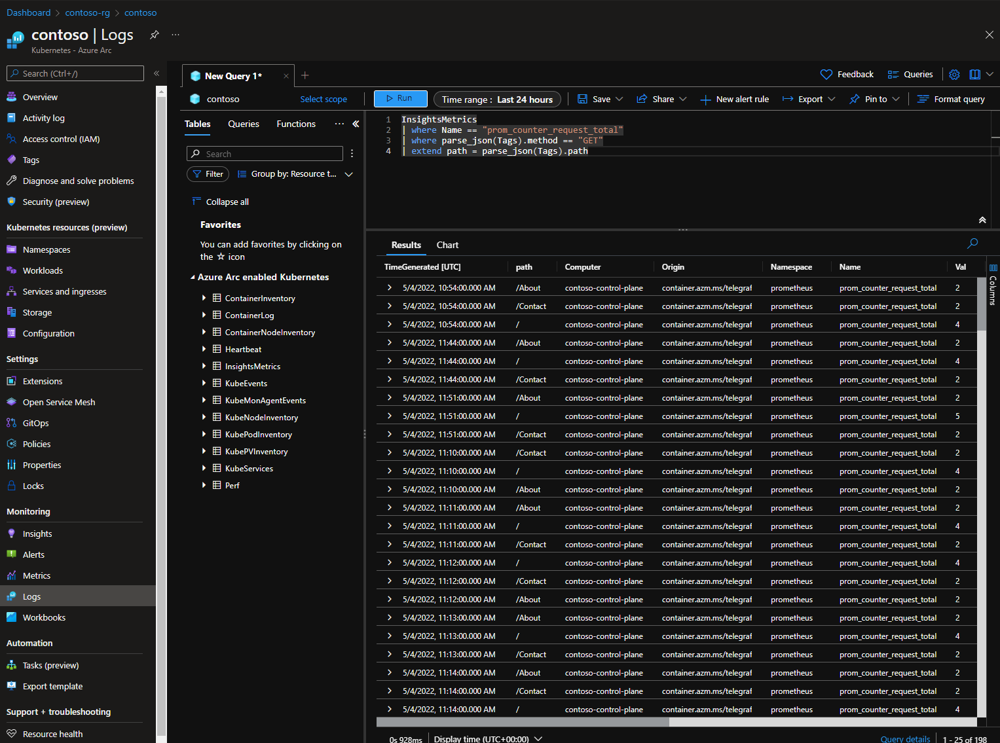

# Kind
This document outline a test to use Kind as the local cluster, and in combination
with Prometheus and Azure Arc for Kubernetes, get metrics to Azure Monitor.

## Overview

This example creates allt the above. First we create a kind cluster locally and install prometheus server in that
cluster. The second step is optional because Container Insight Agent scrap prometheus metrics direct from 
applications. 

The next part of the example is to setup all resources in Azure. We create a resource group and then add our
local cluster to Azure Arc. The next step is to first create an Azure Log Analytics Workspace, where we store
all metrics data, and then enable Azure Monitor by installing the Container Insight Agent in our cluster.

We deploy an example application and enable Container Insight Agent to scrap metrics from our application. By using our application we create new metrics.

Now we can go to our Azure Portal and the blade for our Azure Arc view of our cluster and in the Log view
we can query our metrics.

## Prerequisites
- [Azure CLI](https://docs.microsoft.com/en-us/cli/azure/install-azure-cli?view=azure-cli-latest): Create and manage Azure resources.
    - Extension for managing Azure Arc with Azure CLI
        ```
        az extension add --name connectedk8s
        az extension add -n k8s-extension
        ```
- [Kubectl](https://kubernetes.io/docs/tasks/tools/install-kubectl/): Kubernetes command-line tool which allows you to run commands against Kubernetes clusters.
- [Helm](https://helm.sh/docs/intro/install/): Package manager for Kubernetes
- [Docker](https://docs.docker.com/desktop/)
- [Kind](https://kind.sigs.k8s.io/)

## Installation
1. Create a new Kind cluster
```
kind create cluster --name contoso
```

2. Install Prometheus (optional?)
```
helm repo add stable https://charts.helm.sh/stable

helm repo add prometheus-community https://prometheus-community.github.io/helm-charts

helm repo add kube-state-metrics https://kubernetes.github.io/kube-state-metrics

helm repo update

helm install prometheus-contoso prometheus-community/prometheus
```

3. Create Resource Group
```
 az group create --name contoso-rg --location <location-of-choice>
```

4. Add cluster to Azure Arc for Kubernetes
```
az connectedk8s connect --name contoso --resource-group contoso-rg
```

5. Create a Log Analytics Workspace to store our metrics
```
az monitor log-analytics workspace create -g contoso-rg -n contoso-log -o json --query "id"
```

6. Enable Azure Monitor for containers extension (NOTE: I had problem running this in bash, 
work find in powershell. Need to investigate.)
```
az k8s-extension create --name azuremonitor-containers --cluster-name contoso --resource-group contoso-rg --cluster-type connectedClusters --extension-type Microsoft.AzureMonitor.Containers --configuration-settings logAnalyticsWorkspaceResourceID=<id-from-above-command-including-qutation-mark>
```
When this command is completed, wait 5-10 minutes before any metrics is displayed in Azure Portal.

 

7. Deploy our application (we use a predefined image in docker hub)
```
kubectl apply -f ./deploy/dep.yaml
```

8. Update Container Insight Agent to scrap prometheus metrics from our applications (See README.md
for more information).
```
kubectl apply -f Application/manifests/container-azm-ms-agentconfig.yaml
```

9. Do port forwarding to our application
```
# get pod name
kubectl get po -l app=milkyway-sample
kubectl port-forward <pod-name> 8080:8080
```
10. Open browser to http://localhost:8080 and change pages to create some metrics

11. Do a KQL query
Go to Azure Portal an run the query below.
```
InsightsMetrics
| where Name == "prom_counter_request_total"
| where parse_json(Tags).method == "GET"
| extend path = parse_json(Tags).path
```
