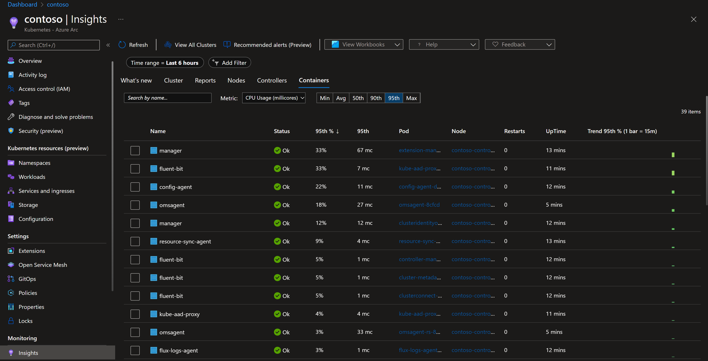

# Kind
This document outline a test to use Kind as the local cluster, and in combination
with Prometheus and Azure Arc for Kubernetes, get metrics to Azure Monitor.

## Prerequisites
* Kind
* az (with arc extensions)

## Installation
1. Create a new Kind cluster
```
kind create cluster --name contoso
```

2. Install Prometheus
```

helm repo add stable https://charts.helm.sh/stable

helm repo add prometheus-community https://prometheus-community.github.io/helm-charts

helm repo add kube-state-metrics https://kubernetes.github.io/kube-state-metrics

helm repo update

helm install prometheus-contoso prometheus-community/prometheus
```

3. Create Resource Group
```
 az group create --name contoso-rg --location <location-of-choice>
```

4. Add cluster to Azure Arc for Kubernetes
```
az connectedk8s connect --name contoso --resource-group contoso-rg
```

5. Enable Azure Monitor for containers extension
```
az k8s-extension create --name azuremonitor-containers --cluster-name contoso --resource-group contoso-rg --cluster-type connectedClusters --extension-type Microsoft.AzureMonitor.Containers
```
When this command is completed, wait 5-10 minutes before any metrics is displayed in Azure Portal.

 

6. Deploy our application (we use a predefined image in docker hub)
```
kubectl apply -f ./deploy/dep.yaml
```

7. Update Prometheus to get metrics from our application
```bash
kubectl apply -f Application/manifests/container-azm-ms-agentconfig.yaml
```

8. Do port forwarding to our application
